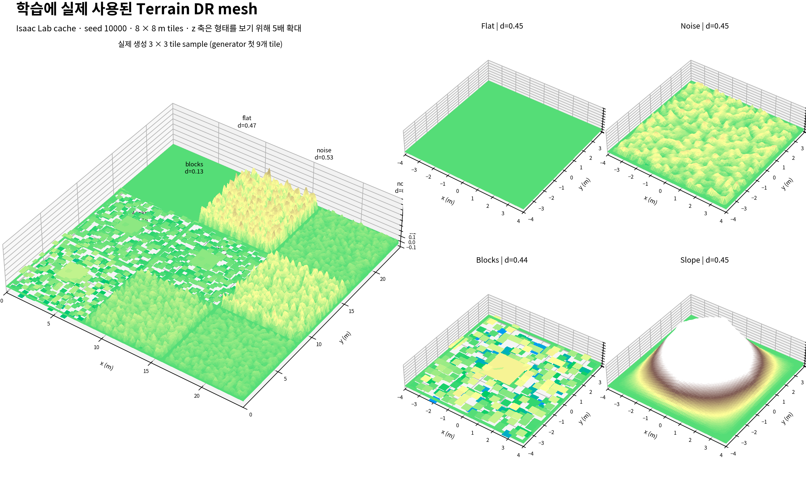

# Ant의 미지 지형 일반화

**평지에서 배운 보행을 새로운 접촉 환경으로 옮길 수 있을까?** Isaac Lab의 Ant에 Terrain DR, Friction DR, 성과 기반 Curriculum, 4-frame History를 누적 적용해 조사했다. 5개 방법을 각각 3개 seed로 학습했고, 제출 모델인 Curriculum seed 0를 팀 공통 4개 환경에서 평가했다.

[문제 정의](#problem) · [방법·가설](#method) · [실험 설정](#setup) · [결과·분석](#experiments) · [재현](#reproduce) · [디렉토리](#directory) · [인용](#references)

<a id="problem"></a>
## 1. 문제 정의

평지와 고정 마찰에서 높은 reward를 얻는 행동은 **같은 발 접촉 조건이 반복된다는 전제**에 맞춰질 수 있다. 요철은 지지 높이를, 경사는 몸의 균형을, 낮은 마찰은 같은 관절 행동이 만드는 추진력을 바꾼다. 현재 관측만으로 마찰 같은 잠재 동역학을 충분히 구분하기도 어렵다. 따라서 평지 학습 점수만으로 미지 지형 보행을 판단할 수 없다.

실험은 세 질문을 나누어 다룬다. **무엇을 경험시킬 것인가**(지형·마찰 DR), **어떤 순서로 경험시킬 것인가**(Curriculum), **얼마나 긴 관측을 줄 것인가**(History). reward와 학습 budget을 고정해 이러한 설계 변경을 조사한다. 여기서 목표는 시뮬레이션 내 일반화이며 실제 로봇 전이 성능은 측정하지 않았다.

<a id="method"></a>
## 2. Method와 가설

[](reports/METHOD.md)

*그림을 클릭하면 구현·수식·통제 조건으로 이동한다. [SVG 확대](reports/method_overview.svg)*

| 가설 | 설계와 기대 효과 | 검증에 필요한 비교 |
| --- | --- | --- |
| H1 · Terrain DR | 평지·요철·블록·경사를 경험하면 새 지형에도 대응 | 동일 미지 지형에서 PPO vs Terrain |
| H2 · Friction DR | 다양한 접촉력을 경험하면 낮은 마찰에 대한 의존 감소 | 지형 고정, 마찰만 바꿔 Terrain vs Friction |
| H3 · Curriculum | 쉬운 조건부터 성과에 맞게 넓히면 어려운 조건 학습에 도움 | 최종 분포가 같은 curriculum 유무 비교 |
| H4 · History | 최근 4개 관측이 접촉 변화의 추론에 도움 | Curriculum vs History의 공통 평가 |

구현은 `PPO → Terrain → Friction → Curriculum → History`의 **누적 구성 비교**다. Friction에는 초기 상태 변화, Curriculum에는 지형·마찰 범위 확대도 동반되므로 개별 요소의 인과 효과를 완전히 분리한 실험은 아니다. [설정 차이와 한계](reports/METHOD.md#3-구현과-누적-비교)

<a id="setup"></a>
## 3. Experiment setup

| 항목 | 설정 |
| --- | --- |
| 학습 반복·예산 | 5 variants × seeds 0/1/2; run당 4096 env × 32 steps × 1000 iterations = **131,072,000 transitions** |
| 공통 정책 | PPO, actor/critic hidden 400–200–100, ELU; 행동 8차원 |
| 최적화 | LR 5e-4 adaptive, γ 0.99, λ 0.95, clip 0.2, epoch 5, mini-batch 4 |
| 제어 | physics 120 Hz, policy 60 Hz; 최대 16초(960 steps) |
| 고정 조건 | robot·actuator·action scale·원본 7개 reward와 가중치·종료 규칙 |
| 학습 지형 | mesh seed 10000; Flat/Noise/Blocks/Slope = 20/30/30/20%; 세부 범위는 [METHOD](reports/METHOD.md) |
| 평가 모델 | Curriculum seed 0, iteration 999; 최신 평가를 위해 재학습하지 않음 |
| 최신 평가 | 팀 v2.1, CLI seed 24, 네 환경 × 첫 episode 100개; deterministic, update 없음 |

[저장된 환경 설정](configs/curriculum_seed0_env.yaml) · [PPO 설정](configs/curriculum_seed0_agent.yaml) · [환경·버전](ENVIRONMENT.md) · [평가 규칙](reports/RESULTS.md#evaluation)

<a id="experiments"></a>
## 4. Experiment — 학습 비교와 평가

### 4.0 학습 환경: 실제 생성 mesh

[](reports/training_terrain_mesh.png)

학습 당시 Isaac Lab terrain cache에서 읽은 실제 OBJ mesh다. 왼쪽은 Terrain DR generator의 첫 3×3 tile이며, 오른쪽은 네 family에서 난이도 약 0.45의 타일을 확대한 것이다. 각 tile은 8 × 8 m이고, **z축만 형태를 읽기 위해 5배 확대**했다. 평지와 네 terrain family의 비율은 전체 학습 mesh에서 20/30/30/20%로 샘플링된다. [이미지 생성 코드](reports/plot_training_terrain_mesh.py) · [Terrain DR 구현](source/isaaclab_tasks/isaaclab_tasks/manager_based/classic/ant/generalization/ant_generalization_env_cfg.py)

### 4.1 학습 중 누적 ablation

각 seed의 마지막 100 iteration(900–999) `Train/mean_reward`를 평균하고, 3개 seed 간 mean ± sample std를 계산했다.

| Variant | 새로 추가한 구성 | 학습 return |
| --- | --- | ---: |
| PPO | 원본 flat | 111.822 ± 4.839 |
| Terrain | 지형 혼합 | 41.294 ± 0.541 |
| Friction | 마찰 + 초기 상태 변화 | 42.344 ± 0.743 |
| Curriculum | 성과 기반 난이도 + 범위 확대 | 40.211 ± 0.879 |
| History | 4-frame 관측 | 40.193 ± 0.505 |

**서로 다른 학습 분포의 return이므로 일반화 순위로 읽지 않는다.** Flat PPO는 더 단순한 환경에서 높은 점수를 얻는다. Friction은 접촉 변화를 추가해도 Terrain과 비슷한 학습 return에 도달했다. Curriculum은 더 넓은 범위를 사용하므로 평균 하락만으로 열등하다고 판단할 수 없다. History의 평균 추가 이득은 뚜렷하지 않다.

[학습 곡선·seed별 수치·해석](reports/RESULTS.md#ablation) · [재계산 가능한 CSV](reports/training_ablation.csv)

### 4.2 새로운 geometry family 평가

2026-10-05 팀 v2.1 평가. 각 행은 동일 checkpoint로 수집한 100 episode의 mean ± sample std다. 학습 로그의 seed 간 std와 구분한다.

| 평가 환경 | 주요 조건 | Return | 960-step 생존율 | 평균 전진 |
| --- | --- | ---: | ---: | ---: |
| Seen-Control | 익숙한 family 혼합 | **59.264 ± 9.762** | **96%** | 53.051 m |
| Unseen-Easy | rails, 고정 마찰 | **57.186 ± 14.420** | **88%** | 51.671 m |
| Unseen-Medium | narrow gap, 가변 마찰 | **60.527 ± 12.341** | **90%** | 54.309 m |
| Unseen-Hard | repeated cylinders, 넓은 마찰 범위 | **19.225 ± 14.967** | **14%** | 17.228 m |

**전이가 유지된 조건:** Easy·Medium의 평균 return과 전진 거리는 Seen과 비슷하다. 다만 생존율은 각각 8%p·6%p 낮아, 평균 점수만으로 같은 안정성을 주장할 수 없다.

**일반화의 경계:** Hard에서는 return이 Seen 대비 67.6% 낮고 평균 episode 지속 시간이 15.56초에서 7.40초로 줄었다. 불규칙한 지지면과 마찰 변화가 함께 작용했을 가능성이 있지만, 어느 요인이 주원인인지는 이 평가로 분리할 수 없다. 결과는 새로운 형상에서 일부 보행이 유지되며 강한 변화에는 한계가 있음을 보여준다.

[조건별 설계 의도·reward 분해·실패 해석](reports/RESULTS.md#evaluation) · [400 episode 원본·설정·로그](reports/RESULTS.md#artifacts) · [팀 취합 CSV](results/team_eval_v2_1_20261005/result_template.csv)

기존 Combined(2026-10-02)는 **29.118270 ± 12.040080**, 100 episodes다. 새 팀 평가와 지형·마찰·seed가 달라 합산하거나 직접 순위 비교하지 않는다. [기존 평가 조건과 원본](reports/RESULTS.md#4-기존-combined-평가--별도-보관)

### 4.3 가설 검증

| 질문 | 현재 결론 |
| --- | --- |
| 새로운 지형에서도 걷는가? | Curriculum seed 0는 rails·gap에서 전진을 유지하지만 Hard에 한계가 있음 |
| Terrain·Friction·Curriculum 각각이 개선했는가? | 다른 variant의 공통 평가가 없어 **개별 기여 미검증** |
| History가 추가로 도움이 되는가? | 마지막 학습 평균의 이득은 불명확; 일반화 효과는 미검증 |
| Curriculum이 최적 모델인가? | 제출·평가 대상이며, 현재 보관된 결과로 최적 순위는 입증할 수 없음 |

다음 검증은 5개 variant와 3개 training seed의 공통 평가, geometry-only / friction-only 대조다. [가설별 근거와 연구 한계](reports/RESULTS.md#hypotheses)

<a id="reproduce"></a>
## 5. 재현

이 저장소는 과제 관련 파일을 담은 **Isaac Lab overlay**다. [지정 commit·환경](ENVIRONMENT.md)의 Isaac Lab root에 같은 상대 경로로 복사해 사용한다. 아래 Python 경로는 기존 실험 환경 기준이다.

```bash
# Curriculum seed 0 학습 (전체 15 runs: train_matrix.py --execute)
setup-image/.venv/bin/python experiments/ant_generalization/prepare.py \
  --variant curriculum --seed 0 --execute

# 기존 Combined 평가: overlay에 포함된 스크립트
export PYTHONPATH="$PWD/source/isaaclab:$PWD/source/isaaclab_assets:$PWD/source/isaaclab_tasks:$PWD/source/isaaclab_rl${PYTHONPATH:+:$PYTHONPATH}"
setup-image/.venv/bin/python experiments/ant_generalization/play_one_episode.py \
  --headless --device cuda:0 \
  --checkpoint checkpoints/curriculum_seed0_model_999.pt \
  --suite combined --num_envs 100 --eval_seed 30000 \
  --output results/curriculum_seed0_combined.json

# 학습 통계·그림 재생성
setup-image/.venv/bin/python reports/summarize_training.py
setup-image/.venv/bin/python reports/plot_training_curves.py
setup-image/.venv/bin/python reports/plot_method.py

# TensorBoard
setup-image/.venv/bin/python -m tensorboard.main \
  --logdir logs/rsl_rl --host 127.0.0.1 --port 6006
```

**팀 v2.1 평가 코드는 이 overlay에 포함되지 않는다.** 해당 wrapper·배포본을 설치한 workspace의 [별도 실행 명령](reports/RESULTS.md#artifacts)을 사용한다. 기존 Combined 스크립트로 최신 팀 평가가 재현되는 것은 아니다.

<a id="directory"></a>
## 6. 디렉토리 구성

| 경로 | 내용 |
| --- | --- |
| [reports/METHOD.md](reports/METHOD.md) | 방법 그림, 구현, 가설, 통제 조건 |
| [reports/RESULTS.md](reports/RESULTS.md) | 학습 ablation, 최신·기존 평가 규칙, 결과 해석, 원본 자료 링크 |
| [reports/](reports/) | 방법 그림 PNG/SVG, 학습 곡선, 집계 CSV와 생성 스크립트 |
| [source/…/ant/generalization/](source/isaaclab_tasks/isaaclab_tasks/manager_based/classic/ant/generalization/) | 지형·마찰·curriculum·history 환경 및 PPO 설정 |
| [experiments/ant_generalization/](experiments/ant_generalization/) | 학습 실행, 15-run matrix, 기존 Combined 평가 스크립트·protocol |
| [configs/](configs/) / [logs/rsl_rl/](logs/rsl_rl/) | 제출 모델 설정 / 15개 학습 run의 TensorBoard·config·checkpoint |
| [checkpoints/](checkpoints/) | Curriculum seed 0 최종 checkpoint |
| [results/](results/) | Combined JSON과 팀 v2.1 JSON·YAML·CSV·log; 결과 설명은 RESULTS에 통합 |
| [ENVIRONMENT.md](ENVIRONMENT.md) | OS, GPU, 라이브러리와 Isaac Lab commit |

<a id="references"></a>
## 7. 인용·연구 자료

| 자료 | 본 프로젝트와의 관계 |
| --- | --- |
| [Schulman et al., 2017 · Proximal Policy Optimization Algorithms](https://arxiv.org/abs/1707.06347) | 모든 variant의 공통 학습 알고리즘 |
| [Tobin et al., 2017 · Domain Randomization](https://arxiv.org/abs/1703.06907) | 학습 환경 다양화라는 배경 개념; 해당 논문은 주로 시각 randomization |
| [Peng et al., 2018 · Sim-to-Real Transfer with Dynamics Randomization](https://arxiv.org/abs/1710.06537) | 접촉 동역학을 다양화하는 설계의 근거 |
| [Rudin et al., 2022 · Learning to Walk in Minutes](https://proceedings.mlr.press/v164/rudin22a.html) | 병렬 보행 학습과 성과 기반 지형 curriculum |
| [Kumar et al., 2021 · RMA](https://arxiv.org/abs/2107.04034) | 시간 관측을 통한 동역학 적응 관련 연구; 본 실험은 단순 stacking |
| [Isaac Lab 연구 보고서, 2025](https://arxiv.org/abs/2511.04831) · [공식 저장소](https://github.com/isaac-sim/IsaacLab) | 시뮬레이션·학습 프레임워크 |
| [본 프로젝트 Method](reports/METHOD.md) · [Results](reports/RESULTS.md) | 실제 구현과 측정 결과, 연구적 해석 및 한계 |
