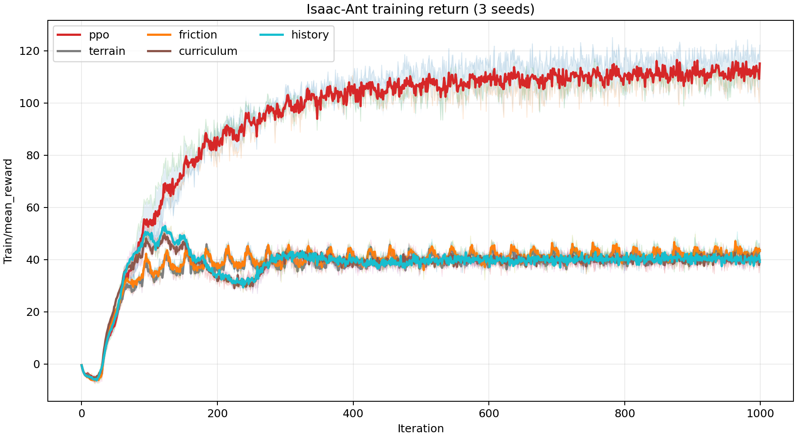

# Isaac-Ant Unseen Terrain Generalization

Isaac Lab의 `Isaac-Ant-v0`를 다양한 terrain geometry와 contact friction에서 학습해 unseen terrain의 robustness를 높인 PPO 프로젝트다. 원본 reward와 PPO hyperparameter는 유지하고, training distribution만 단계적으로 확장했다.

## 제출물 구성

| 요구 항목 | 위치 |
| --- | --- |
| Environment code | `source/isaaclab_tasks/.../ant/generalization/` |
| RL / training code | `experiments/ant_generalization/` |
| 실행 당시 config | `configs/`, 각 run의 `params/` |
| TensorBoard log | `logs/rsl_rl/ant_generalization_*` |
| Checkpoint | `checkpoints/curriculum_seed0_model_999.pt` 및 각 run의 `model_999.pt` |
| 평가 명령어 | 아래 **평가** 절 |
| 평가 결과와 해석 | `reports/RESULTS.md` |
| Training curve | `reports/training_return_curve.png` |

`ant_generalization_smoke`의 `model_1.pt`와 smoke log는 제출 결과에서 완전히 제외했다. 저장소의 checkpoint는 모두 1,000 iteration 본 학습에서 생성된 `model_999.pt`다.

## Method

누적 ablation은 다음과 같다.

1. `PPO`: 원본 flat environment
2. `Terrain DR`: Flat 20% + Random Noise 30% + Random Blocks 30% + Slope 20%
3. `Friction DR`: terrain + environment별 contact friction + 작은 initial-state perturbation
4. `Curriculum`: 전진 거리에 따라 terrain level과 friction range를 함께 조정
5. `4-frame History`: curriculum + 최근 observation 4개 frame

최종 model은 Combined robustness와 seed 안정성이 가장 좋은 `Curriculum`의 seed 0 checkpoint다.

## 실행 환경

- Ubuntu 24.04
- NVIDIA RTX 3090, driver 580.178.04
- Isaac Lab commit `f4aa17f87e2e5db5484f0b5974918573e8918ce2` (`v2.3.2-13-gf4aa17f87e2`)
- Python 3.11
- PyTorch `2.7.0+cu128`
- `rsl-rl-lib 5.0.1`

이 저장소는 전체 Isaac Lab 복사본이 아니라 과제 관련 파일만 포함하는 overlay다. 위 commit의 Isaac Lab root에 같은 상대 경로로 파일을 복사한 뒤 실행한다.

## 학습

Isaac Lab root에서 다음 명령을 실행한다.

```bash
setup-image/.venv/bin/python \
  experiments/ant_generalization/prepare.py \
  --variant curriculum --seed 0 --execute
```

전체 5 variant × 3 seed:

```bash
setup-image/.venv/bin/python \
  experiments/ant_generalization/train_matrix.py --execute
```

본 학습은 run당 `4096 env × 32 step × 1000 iteration = 131,072,000 transition`이다.

## 평가

과제 평가 결과는 반드시 `play_one_episode.py`의 산출물을 사용한다. Script는 100개 parallel environment에서 각각 첫 episode 하나를 수집한 뒤, environment별 cumulative episode return의 mean과 sample standard deviation을 자동 출력한다.

Isaac Lab root에서 실행:

```bash
export PYTHONPATH="$PWD/source/isaaclab:$PWD/source/isaaclab_assets:$PWD/source/isaaclab_tasks:$PWD/source/isaaclab_rl${PYTHONPATH:+:$PYTHONPATH}"

setup-image/.venv/bin/python \
  experiments/ant_generalization/play_one_episode.py \
  --headless --device cuda:0 \
  --checkpoint checkpoints/curriculum_seed0_model_999.pt \
  --suite combined \
  --num_envs 100 \
  --eval_seed 30000 \
  --output results/curriculum_seed0_combined.json
```

`combined` suite는 held-out rough terrain과 고정 contact friction `0.2`를 동시에 적용한다. 다른 suite는 `flat`, `seen`, `unseen_rough`, `unseen_slippery` 중 선택할 수 있다.

## Log 확인

```bash
setup-image/.venv/bin/python -m tensorboard.main \
  --logdir logs/rsl_rl --host 127.0.0.1 --port 6006
```

Training curve를 다시 생성하려면:

```bash
setup-image/.venv/bin/python reports/plot_training_curves.py
```



## 주요 파일

- `ant_generalization_env_cfg.py`: terrain, friction, curriculum, evaluation suite
- `mdp.py`: custom terrain generator, terrain curriculum, foot material randomization
- `rsl_rl_ppo_cfg.py`: PPO runner config
- `prepare.py`: variant별 재현 가능한 training command
- `play_one_episode.py`: 공식 100-environment 평가 script
- `reports/RESULTS.md`: 평가 결과 provenance와 해석

