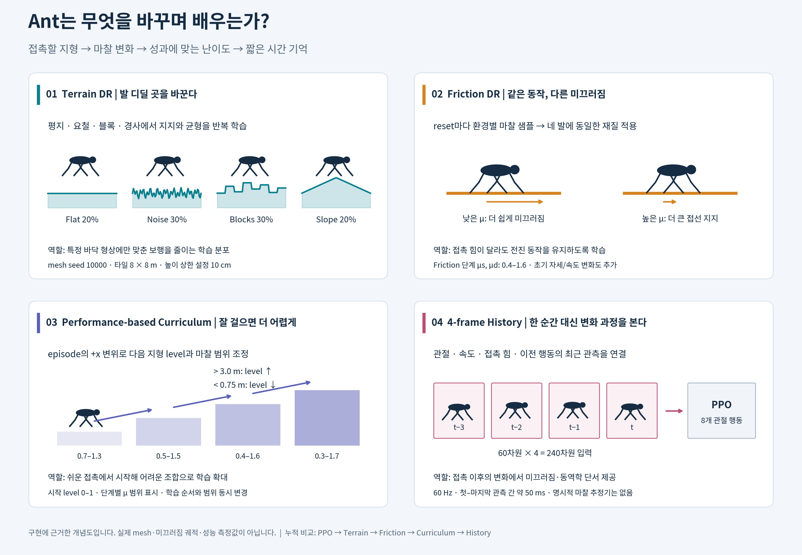

# Method — 미지 지형에 대비하는 학습 환경

[프로젝트 요약](../README.md) · [실험 결과와 가설 검증](RESULTS.md) · [실행 환경](../ENVIRONMENT.md)

## 1. 문제와 설계 원리

평지에서 전진 reward를 높인 정책이 요철·경사·미끄러운 바닥에서도 안정적으로 걷는다는 보장은 없다. 발을 놓는 높이와 접촉력이 바뀌면 학습한 행동의 결과도 달라진다. 본 실험은 **reward를 고정하고, 학습 시 경험하는 지형·마찰과 난이도 제시 방식을 바꾸는 접근**을 조사한다. 이는 시뮬레이션 안의 일반화 실험이며 실제 로봇 전이를 검증한 실험은 아니다.

## 2. 네 구성요소의 역할

*클릭하면 확대 가능한 SVG로 이동한다. 구현에 근거한 개념도이며 실제 생성 mesh나 측정된 보행 궤적은 아니다. [그림 생성 코드](plot_method.py)*

| 구성요소 | Ant가 경험하는 변화 | 기대하는 역할 | 확인할 가설 |
| --- | --- | --- | --- |
| **Terrain DR** | 평지·요철·블록·경사에서 발의 접촉 높이와 지지면 변화 | 한 바닥에만 맞춘 행동을 줄이고 자세 회복 경험 확보 | H1: 동일한 미지 지형 평가에서 flat PPO보다 개선 |
| **Friction DR** | 같은 행동에도 접선 지지력과 미끄러짐이 달라짐 | 특정 접촉 마찰에 대한 의존 감소 | H2: 낮은 마찰 평가에서 Terrain보다 개선 |
| **Performance-based Curriculum** | 전진 성과에 따라 다음 episode의 지형 level과 마찰 범위 변경 | 초반에 쉬운 경험을 확보하면서 어려운 조합으로 확대 | H3: 동일한 최종 분포를 무작위로 제시할 때보다 학습·일반화 개선 |
| **4-frame History** | 순간 관측 대신 관절·속도·접촉 힘·이전 행동의 시간 변화 제공 | 직접 관측하지 않는 접촉 동역학을 추론할 단서 제공 | H4: Curriculum 대비 미지 접촉 조건 성능 개선 |

H1–H4는 **설계 가설**이다. 현재 보관된 데이터로 검증할 수 있는 범위는 [결과 문서](RESULTS.md#hypotheses)에 구분했다. History는 명시적 마찰 추정기나 RMA adaptation module을 구현한 것이 아니다.

## 3. 구현과 누적 비교

설정: [환경 코드](../source/isaaclab_tasks/isaaclab_tasks/manager_based/classic/ant/generalization/ant_generalization_env_cfg.py) · [지형·마찰·curriculum 함수](../source/isaaclab_tasks/isaaclab_tasks/manager_based/classic/ant/generalization/mdp.py)

| Variant | 지형 / 난이도 d | 마찰·초기 상태 | 난이도 조정 | 관측 |
| --- | --- | --- | --- | --- |
| PPO | 원본 flat | 원본 설정 | 없음 | 60 |
| Terrain | 20/30/30/20 혼합, d ∈ [0, 0.6] | 원본 reset, 고정 재질 | 없음 | 60 |
| Friction | Terrain과 동일 | 발 마찰 0.4–1.6 + 초기 상태 변화 | 없음 | 60 |
| Curriculum | 동일 family, d ∈ [0, 1] | level별 0.7–1.3 → 0.5–1.5 → 0.4–1.6 → 0.3–1.7 | 성과 기반 | 60 |
| History | Curriculum과 동일 | Curriculum과 동일 | 성과 기반 | 240 |

**Terrain DR.** seed 10000의 고정 mesh에 Flat 20%, Noise 30%, Blocks 30%, Slope 20%를 배치한다. 8 × 8 m 타일, 10행 × 20열이다. 지형을 매 step 새로 만드는 방식은 아니다. Noise 진폭 설정은 `0.005 + d × 0.095 m`, Blocks 높이는 `d × 0.10 m`, Slope 기울기는 `d × 0.35`다. 따라서 Terrain/Friction의 상한은 각각 약 6.2 cm / 6 cm / 0.21이고, Curriculum에서 전체 설정 범위를 사용한다. mesh의 양자화와 난이도 샘플링 때문에 설정 상한이 실제 최대 높이와 반드시 같지는 않다.

**Friction DR.** reset 때 환경마다 재질 bucket을 하나 뽑아 네 발에 동일하게 적용한다. 정지·동마찰은 64개 bucket을 사용하고 동마찰 ≤ 정지마찰을 유지한다. ground 마찰 1.0과 `multiply`로 결합한다. 초기 높이 ±2 cm, roll/pitch/yaw ±0.05 rad, 관절 위치·속도 ±0.1 및 작은 base 속도 변화도 함께 추가된다. 따라서 이 비교는 **마찰과 초기 상태 변화의 묶음 효과**다.

**Curriculum.** level 0–1에서 시작하고 episode 종료 시 원점 대비 +x 변위가 `>3.0 m`이면 승격, `<0.75 m`이면 강등, 그 사이면 유지한다. level을 네 구간으로 나누어 마찰 범위를 확대한다. 이 단계에서는 정지·동마찰이 같은 값을 사용한다. **학습 순서, 지형 범위, 마찰 범위·분포가 함께 바뀌므로 순수한 curriculum 단독 ablation은 아니다.**

**History.** 60 Hz에서 최근 4개 관측을 연결한다(`60 × 4 = 240`). 첫 관측과 마지막 관측 사이 시간은 약 50 ms다. hidden layer 크기는 같지만 입력층이 커지므로 파라미터 수도 늘어난다. 성능 차이가 생겨도 기억 효과와 입력층 용량 효과를 완전히 분리할 수 없다.

## 4. 공통 학습 조건

| 항목 | 고정 조건 |
| --- | --- |
| 학습량 | 4096 env × 32 step × 1000 iteration = **131,072,000 transitions/run** |
| 반복 | 5 variant × training seed 0, 1, 2 = 15 runs |
| 정책 | PPO, actor/critic hidden 400–200–100, ELU; 행동 8차원 |
| PPO | LR 5e-4 adaptive, γ 0.99, λ 0.95, clip 0.2, epoch 5, mini-batch 4 |
| 물리·제어 | dt 1/120 s, decimation 2 → policy 60 Hz; 최대 16 s = 960 steps |
| 고정 요소 | robot·질량·관성·actuator·action scale·reward 7항 및 가중치·종료 규칙 |
| 종료 | time-out 또는 torso world-frame 높이 <0.31 m |

[실제 저장된 env 설정](../configs/curriculum_seed0_env.yaml) · [agent 설정](../configs/curriculum_seed0_agent.yaml) · [15개 run 로그·설정](../logs/rsl_rl/) · [실행 명령](../README.md#reproduce)

학습 mesh의 실제 생성 모습은 [README의 Experiment 그림](../README.md#40-학습-환경-실제-생성-mesh)에서 확인할 수 있다. 그림은 실행 당시 cache의 OBJ를 읽는다.

## 5. 학습·평가 분리

| 구분 | 지형 seed | 질문 |
| --- | --- | --- |
| 학습 | 10000 | 서로 다른 학습 분포에서 학습이 진행되는가? |
| 기존 Seen 설정 | 20000 | 익숙한 family의 별도 mesh에서도 동작하는가? |
| 기존 Combined 평가 | 30000 | Noise/Blocks의 높이·폭 변화와 고정 마찰 0.2에 견디는가? |
| 팀 v2.1 Seen-Control | 51004 | 익숙한 family를 사용하는 팀 기준 조건에서 동작하는가? |
| 팀 v2.1 Easy / Medium / Hard | 53001 / 53012 / 53003 | 학습에 없던 rails / gap / cylinders로 전이되는가? |

기존 Combined는 Noise/Blocks라는 family 자체가 새롭지는 않다. 높이 설정 8–12 cm, block 폭 30 cm와 마찰 0.2를 바꾸는 **범위·접촉 조건 변화**다. 팀 평가는 **새로운 geometry family**를 사용하며, Seen-Control도 혼합 비율과 noise 정의가 달라 학습 분포의 완전한 복제는 아니다.

팀 평가는 이미 정한 Curriculum seed 0의 `model_999.pt`를 사용했다. 저장된 자료만으로는 이것이 5개 방법 중 최적이라는 선택 근거를 재구성할 수 없으므로, 여기서는 **제출·평가 대상 모델**로만 부른다. 평가 중 gradient update와 성과 기반 level 조정은 없다. [최신 평가 규칙·한계](RESULTS.md#evaluation)

## 6. 연구 근거

- [PPO — Schulman et al., 2017](https://arxiv.org/abs/1707.06347): 모든 variant에 공통인 정책 최적화 알고리즘.
- [Dynamics Randomization — Peng et al., 2018](https://arxiv.org/abs/1710.06537): 동역학을 다양화해 전이 성능을 학습한다는 근거. 본 실험에서는 접촉 마찰에 적용했다.
- [Learning to Walk in Minutes — Rudin et al., 2022](https://proceedings.mlr.press/v164/rudin22a.html): 대규모 병렬 학습과 성과 기반 지형 curriculum의 연구 근거. 여기의 전진 임계값과 마찰 단계는 프로젝트 구현이다.
- [RMA — Kumar et al., 2021](https://arxiv.org/abs/2107.04034): 과거 관측을 통한 동역학 적응의 관련 연구. 본 실험의 단순 frame stacking과는 구조가 다르다.
